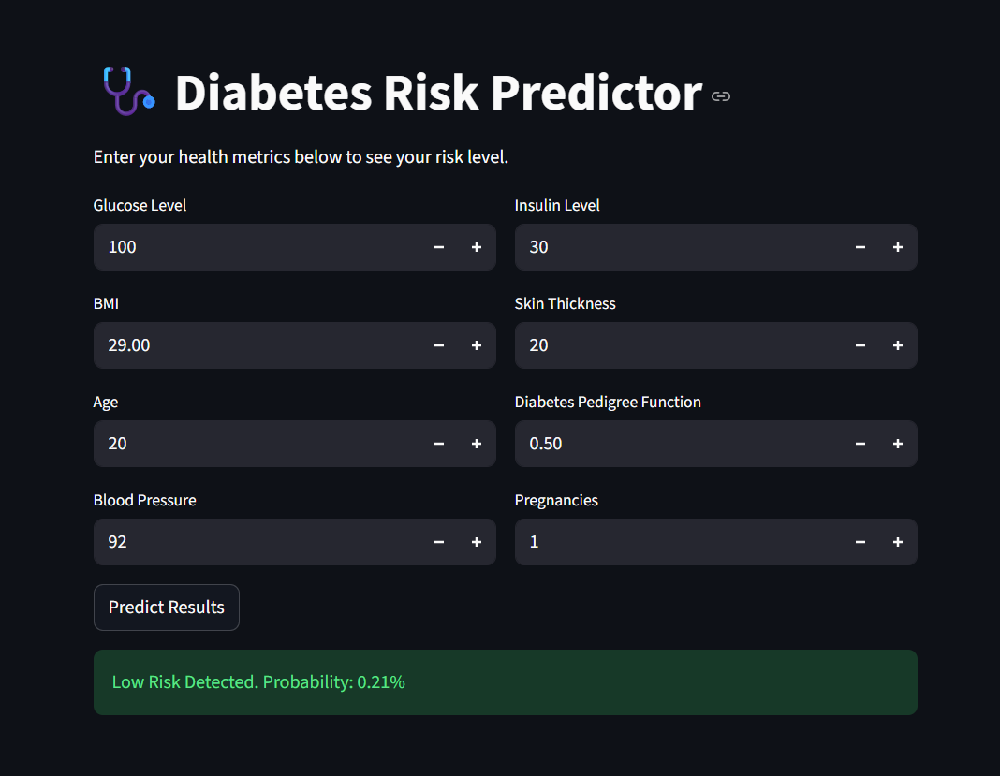

# Diabetes-detection

🔗 Live Demo Link: https://diabetes-detection-dskt4tnfuti5pqks8vxqqq.streamlit.app/

📌 Project Overview
This project is an end-to-end Machine Learning solution designed to predict the likelihood of diabetes in patients based on specific diagnostic measurements. The goal was to build a highly interpretable and deployable model that provides instant feedback to users via a web interface.

🚀 FeaturesXGBoost Engine: Utilizes Gradient Boosting for high-precision classification.Robust Preprocessing: Handles missing values (zeros in medical data) using median imputation and standard scaling.
Interactive UI: A Streamlit dashboard allowing users to input metrics like BMI, Insulin, and Glucose.Explainable AI: Displays feature importance to show which health factors are driving the risk assessment.

🧠 Model Logic & Architecture:
I chose XGBoost over traditional models because medical datasets often contain non-linear relationships.Sequential Learning: The model grows trees sequentially, where each new tree corrects the residuals (errors) of the previous one.Regularization: Uses $L1$ and $L2$ regularization to prevent overfitting on small clinical datasets.
Optimization: Minimizes a convex loss function while controlling model complexity.

📊 Dataset Features:
The model is trained on the following health parameters:Glucose: Plasma glucose concentration.BMI: Body Mass Index (weight in $kg/(height in m)^2$).Age: Years.Insulin: 2-Hour serum insulin.Blood Pressure: Diastolic blood pressure.Skin Thickness: Triceps skin fold thickness.Pregnancies: Number of times pregnant.Diabetes Pedigree Function: Genetic influence score.

An ML-based web application to predict diabetes risk using XGBoost and Streamlit

🛠️ Installation & Usage
To run this project locally:

Clone the repository: git clone https://github.com/amitisingh/Diabetes-detection.git

Bash
git clone https://github.com/YOUR_USERNAME/YOUR_REPO_NAME.git
Install Dependencies: pip install -r requirements.txt

Bash
pip install -r requirements.txt
Run the Dashboard: streamlit run app.py

Bash
streamlit run app.py
Developed by Amiti B.Tech in CSE (Specialization in AI/ML)
